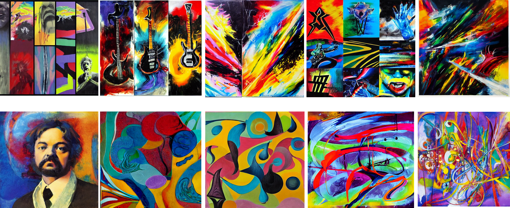

<!-- PROJECT LOGO -->
<br />
<p align="center">
  <a href="https://github.com/jorgenhw/visual_analytics_exam_project">
    
  </a>
  <h1 align="center">Cultural Datascience 2023</h1> 
  <h2 align="center">Final project</h2> 
  <h3 align="center">Visual Analytics</h3> 


  <p align="center">
    Jørgen Højlund Wibe<br>
    Student number: 201807750
  </p>
</p>


<!-- ABOUT THE PROJECT -->
## About the project
This project enables you to change your Spotify playlist cover photos with images that artistically resembles the content of the playlist. This is achieved through the use of state-of-the-art text-to-image generaters. The inputs to the image generator are the song titles and belonging artists (obtained via [Spotify's API](https://developer.spotify.com/documentation/web-api)). The output is a creative and artsy visual representation.

To show how it works, two sample photos are included in the ```samples``` folder. These are images generated using this method on 1) a playlist containing rock music and 2) a playlist containing classical music. These serves as an example of how the model interprets playlists visually. URI's to the playlists are located in ```sample_playlists.txt```.

<!-- USAGE -->
## Usage

To use or reproduce the results you need to adopt the following steps.

**NOTE:** There may be slight variations depending on the terminal and operating system you use. The following example is designed to work using the Visual Studio Code version 1.77.3 (Universal). The terminal code should therefore work using a unix-based bash. The avoid potential package conflicts, the ```setup.sh``` bash files contains the steps necesarry to create a virtual environment, install libraries and run the project.

1. Get a free Spotify API Key
2. Get a Spotify playlist ID
3. Clone repository
4. Update the ```.env``` file
5. Run ```setup.sh```

### Get Spotify API keys
In order to get the required Spotify API keys, you'll need to create a Spotify application through their Developer Dashboard. Here's a step-by-step guide to help you get started:

1. Login/register with your Spotify credentials at the [**Spotify Developer Dashboard**](https://developer.spotify.com/).
2. Once you're logged in, navigate to the Dashboard and click on the **"Create App"** button.
3. **Fill in** the application details and create it.
4. Obtain the **client ID** and **client secret**: On the application settings page, you'll find your client_id and client_secret. These are unique identifiers for your application and are necessary for authenticating your requests to the Spotify API. Store them securely.

### Get a Spotify playlist URI
To obtain a Spotify Playlist URI, open your Spotify Desktop app and navigate to a playlist. You can copy the Spotify URI by
1. Clicking on the three dots opening the playlist settings
2. Hover over **Share**
3. Hold **Alt** (on Mac) or **Ctrl** (on Windows)
4. Click on: '**Copy Spotify URI**'.

The URI looks like this: *"spotify:playlist:2e3scy56lPjABWt1DHTJvH"*

### Clone repository

Clone repository using the following lines in the unix-based bash:

```bash
git clone https://github.com/jorgenhw/visual_analytics_exam_project.git
cd visual_analytics_exam_project
```

### Update the ```.env``` file
Enter your ```client_id```, ```client_secret``` and ```playlist URI``` in the environment file ```.env```.
```bash
SPOTIPY_CLIENT_ID = 'your key here'
SPOTIFY_CLIENT_SECRET = 'your key here'
SPOTIFY_PLAYLIST_ID = 'your key here'
#openai_key = 'your key here' # [OPTIONAL]
```
Uncomment the ```open_ai``` variable if you wish to use DALL·E instead of StableDiffusion (read more about this in the ```Change infrastructure``` section later in this readme). Save file. These are now global environment variables which the script can read when you run it.

### Run ```setup.sh```

To replicate the results, I have included a bash script that automatically 

1. Creates a virtual environment for the project
2. Activates the virtual environment
3. Installs the correct versions of the packages required
4. Runs the script
5. Deactivates the virtual environment

Run the code below in your bash terminal:

```bash
bash setup.sh
```

### [Optional] Changing arguments via ```argparse```
To provide more flexibility and enable the user to change the parameters of the script from the command line, we have implemented argparse in our script. This means that by running the script with specific command line arguments, you can modify parameters such as the batch size, the number of epochs to train the model, and the learning rate.

To see all the available arguments, simply run the command:

```bash
python main.py --help
```

### [Optional] Change infrastructure
The script is set up to use the StableDiffusion models which are freely available through [HuggingFace](https://huggingface.co/). However, if one wish to use [OpenAI's DALL·E](https://openai.com/product/dall-e-2) instead, this can be done with a few changes to the ```main.py``` script and the ```.env``` file.

1. Navigate to ```.env``` and insert your OpenAI access token which can be obtained [here](https://openai.com/blog/openai-api).
2. Navigate to ```main.py``` and comment out line 29, 32, and 35. Then remove ### on line 39, 42, 45, and 48.

**IMPORTANT**: The use of DALL·E costs a small amount of money. Remember to check on this prior to use.

## Inspecting results

The generated image will be located in the ```output``` folder. Here one can inspect the results.

<!-- REPOSITORY STRUCTURE -->
## Repository structure

This repository has the following structure:
```
│   main.py
│   README.md
│   requirements.txt
│   setup.sh
│   .env
│   .cache
│   sample_playlists.txt
│
├───readme_images
│       cover_photo.png
│
├───output
│       empty folder 
│
├───examples
│       classical_playlist_image_1.png
│       classical_playlist_image_2.png
│       classical_playlist_image_3.png
│       classical_playlist_image_4.png
│       classical_playlist_image_5.png
│       rock_playlist_image_1.png
│       rock_playlist_image_2.png
│       rock_playlist_image_3.png
│       rock_playlist_image_4.png
│       rock_playlist_image_5.png
│
└──src
        image_gen_DALLE.py
        image_gen_StableDiffusion.py
        spotipy.py
```

<!-- RESULTS -->
## Remarks on findings
In this project, we have explored the exciting intersection of cultural data science and visual analytics by developing a system that generates artistic cover photos for Spotify playlists. By leveraging state-of-the-art text-to-image generation models, we have created a pipeline that transforms the textual information of song titles and artists into visually captivating representations.

The motivation behind this project was to enhance the visual experience of Spotify playlists and provide users with personalized and engaging cover photos. We aimed to bridge the gap between the auditory and visual aspects of music, allowing users to immerse themselves in the aesthetic essence of their playlists.

To facilitate the understanding and replication of our work, we have provided detailed instructions in this README file. From obtaining Spotify API keys and playlist URIs to running the setup script, we have outlined the necessary steps to reproduce the results. Furthermore, we have included example playlist images in the examples folder, showcasing the visual interpretations generated by our models. These images were generated without seeds and can as such not be replicated 1:1.

This project offers flexibility and customization through the use of command line arguments, allowing users to adjust parameters such as batch size, training epochs, and learning rate. Additionally, we have provided an option to switch between the StableDiffusion models and OpenAI's DALL·E, enabling users to explore different image generation infrastructures.

By making our code open-source and sharing our methodology, we hope to inspire further exploration and innovation in the field of cultural data science and visual analytics. We believe that the fusion of data-driven approaches and artistic creativity can yield captivating results and unlock new possibilities in various domains.

In conclusion, this project represents a successful integration of cultural data science, visual analytics, and artistic expression. We invite users to delve into the code, experiment with different playlists, and unleash their creativity in the world of cultural data science.